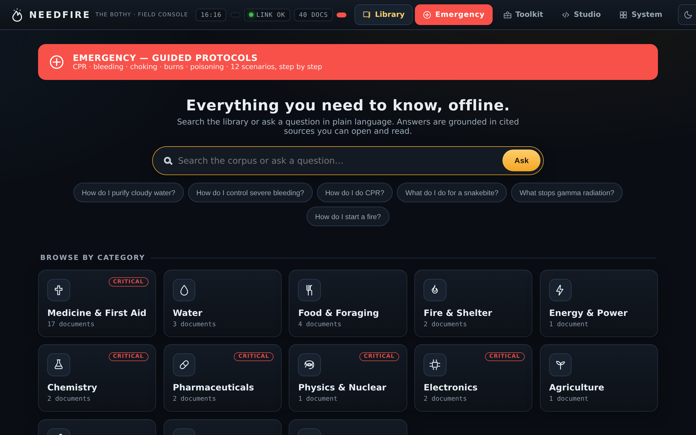
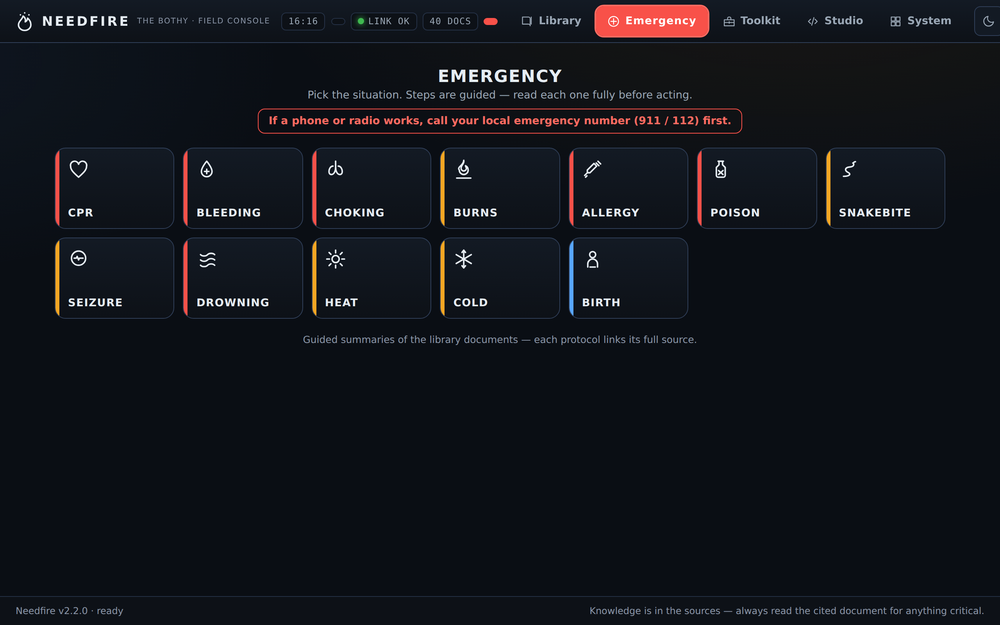
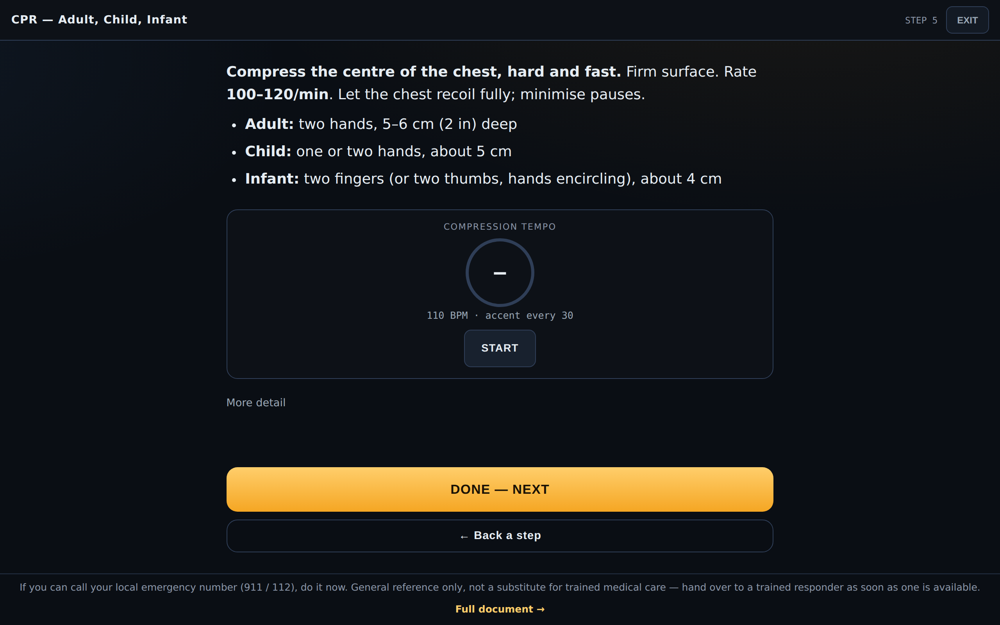
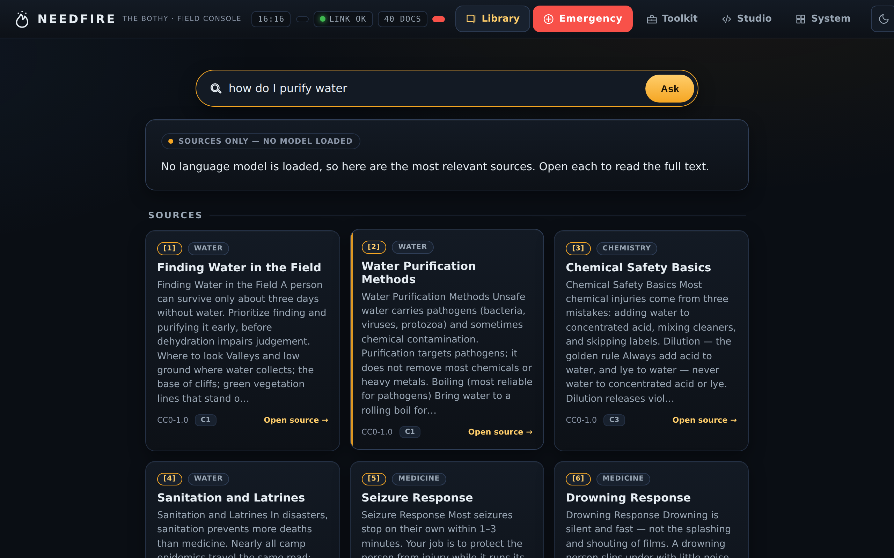
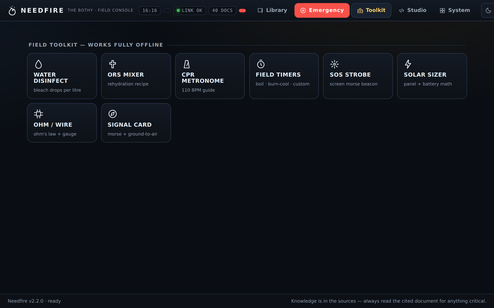

# Needfire — the offline survival knowledge computer

> A citable survival library with guided emergency protocols and optional local AI —
> pure-stdlib Python, zero dependencies, runs on anything from a laptop to a Raspberry Pi.

[](https://github.com/BlipBloopBlopBlingBoop/Needfire/actions/workflows/ci.yml)


[](CONTRIBUTING.md)



## Run it in 30 seconds

```bash
git clone https://github.com/BlipBloopBlopBlingBoop/Needfire.git
cd Needfire
python3 -m needfire serve     # then open http://localhost:8848
```

**No pip. No Node. No model. No internet.** Python 3.8+ is the only requirement — or use
`docker compose up`, or just double-click a launcher (see [`START-HERE.txt`](START-HERE.txt)).

## What it is

- **A citable offline library** — 84 bundled CC0 reference docs (first aid, water, food, fire,
  chemistry, radiation, navigation…), extensible to full offline Wikipedia/WikiMed/iFixit archives.
- **RAG with citations** — ask in plain language; every answer points at the source document.
  Works *sources-only* with no AI at all, or plugs into local models via [Ollama](https://ollama.com).
- **12 guided emergency protocols** — CPR (with a compression metronome), bleeding, choking, burns,
  poisoning, and more: step-by-step, offline, phone-friendly.
- **An offline field toolkit (27 tools)** — water disinfection doses, ORS mixer, field timers, SOS
  strobe, solar/battery sizing, Ohm's-law + mechanical-advantage helpers, wind-chill/heat-index,
  lightning range, fallout decay, ration planner, a DR-ABC casualty check, a field estimator, a unit
  converter, a disinfectant-dilution mixer, and a survival-priorities card — plus a full **offline
  navigation package**: sun & moon compass (true bearing, rise/set, phase), a bright-star **sky
  chart** for any place and time, latitude/longitude from Polaris or the noon sun, a dead-reckoning
  leg log, a lat/lon ↔ UTM grid converter, and pace/declination/weather aids. All pure client-side
  math — no signal, no GPS.
- **A buildable appliance** — BOMs, build runbook, systemd/firewall provisioning, and Pi/x86 image
  builders to turn a spare machine into a hardened, off-grid "Bothy."
- **Degrades gracefully** — reasoning model → tiny model → sources-only; vector search → keyword →
  LIKE scan. Every layer works when the one above it fails.

## Who are you? — one doc for each path

- 🚀 **Just want to use it?** → **[`QUICKSTART.md`](QUICKSTART.md)** is the complete, plain-English
  guide for every system — Windows, Mac, Linux, phones, and iPhone/iPad. If you downloaded the
  one-folder package, double-click the launcher and read the bundled [`START-HERE.txt`](START-HERE.txt),
  the 10-second version. (Build that package with `make dist`.)
- 🖥️ **Developer or self-hoster?** → **[`PROJECT.md`](PROJECT.md)** — how the pure-stdlib app and
  no-build field console are built, plus the **System** hub (in-UI **AI model management** and
  **content download**) and the password-gated **Studio** workspace (web playground, file editor,
  terminal, and Python — a real standalone computer).
- 📐 **Building the Bothy (the hardware appliance)?** → the numbered **build handbook**
  ([`01-ARCHITECTURE.md`](01-ARCHITECTURE.md) → [`06-BUILD-RUNBOOK.md`](06-BUILD-RUNBOOK.md)): what to
  buy, how to assemble it, what to load, and how to harden it — all **off-the-shelf hardware** and
  **open-source software**, sourceable and repairable by one person.

## The names

In old European folk practice, when disaster struck, a village extinguished every hearth and
kindled one new flame by friction — the ***needfire*** — from which every fire was relit.
**Needfire** is that reserve flame for knowledge: the software you fall back on to relight
everything else. The hardware it runs on is the **Bothy** — named for the unlocked Scottish mountain
shelters kept stocked for whoever stumbles in from the storm. Its mascot is the pika, the small
alpine haymaker that spends all summer stockpiling and drying plants so it can outlast winter.

This repo is **both** the design package **and** the real, running software: **Needfire** (the
knowledge system) and **the Bothy** (the appliance you build to carry it).

---

## ⚠️ Read this first (hard truths)

- **Use at your own risk.** Everything here is reference material — not professional medical,
  legal, electrical, or engineering advice, and never a substitute for **calling your local
  emergency number** when one is reachable. No warranty, no liability. The plain-language version
  is in [**DISCLAIMER.md**](DISCLAIMER.md) — read it once before you rely on any of this.
- **Local AI models hallucinate.** Every answer in this system is paired with the **primary source
  document** it came from (RAG with citations). For anything life-critical — medicine, dosing, water,
  chemistry, electrical — **read the source, not the chatbot's paraphrase.** The model is an index and
  a tutor, not an authority.
- **No warranty.** These are reference figures and representative parts. Prices, model names, and
  capacities drift. Verify specs before you buy. Test everything *before* you need it.
- **Corpus licensing is on you.** Most sources here are free and openly licensed (CC, public domain,
  GFDL). Some references are copyrighted; download and use only what you are legally entitled to in
  your jurisdiction. The download catalog lists **openly-licensed** sources by default.
- **EMP hardening is risk-reduction, not a guarantee.** A Faraday enclosure and a cold-stored spare
  improve your odds. They are not a certified shield.
- **Legality & safety.** This package preserves *knowledge*. It is oriented toward survival, medicine,
  power, agriculture, and radiation **safety** — not toward producing weapons. Some preserved knowledge
  (industrial chemistry, nuclear physics) is dual-use; handle it with the seriousness it deserves and
  within the law.

---

## The Bothy in three sizes (one architecture)

| | **Personal** | **Homestead** *(reference)* | **Community** |
|---|---|---|---|
| Serves | 1 operator | 1 household / small group | a settlement (dozens) |
| Compute | Mini-PC / SBC, 16–32 GB RAM | Mini-PC/SFF, 64 GB RAM, optional GPU | 2–3 node cluster + GPU node |
| Storage | 2–4 TB SSD | 8–16 TB (SSD hot + HDD cold) | 24 TB+ redundant |
| Corpus | curated subset | full deep archive | full archive, replicated |
| Power | power bank + 100 W foldable solar | LiFePO₄ + 400–800 W solar + MPPT | LiFePO₄ bank + 1–2 kW array |
| Form | Pelican case, backpack | ammo-can / rugged, Faraday-lined | rackable rugged, distributed |
| Est. cost* | ~$700–1,500 | ~$2,500–5,500 | ~$8,000–16,000+ |

\* Ballpark, USD, using new-or-used off-the-shelf parts. See `bom/` for itemized numbers.

All tiers run the **same application (`python3 -m needfire`), the same SQLite index format, the same
corpus layout (`NEEDFIRE_HOME`), and the same web interface.** Optional Ollama models are the only piece
that scales with hardware. You can start at Personal and grow into Homestead by adding storage and
models — nothing is throwaway.

---

## How Needfire differs

| | **Needfire** | Kiwix / Internet-in-a-Box | PrivateGPT-class RAG apps | Prepper PDF dumps |
|---|---|---|---|---|
| Runs with zero dependencies | ✅ Python stdlib only | ❌ packaged server | ❌ pip + models required | ✅ but it's just files |
| Cited AI answers | ✅ optional — degrades to sources-only | ❌ search only | ✅ needs model/GPU | ❌ |
| Guided emergency protocols | ✅ 12, offline PWA | ❌ | ❌ | ❌ |
| Offline field toolkit | ✅ timers, dosing, solar math | ❌ | ❌ | ❌ |
| Hardened-appliance build docs | ✅ BOM → runbook → image | partial | ❌ | ❌ |
| Useful with no model and no index | ✅ by design | ✅ | ❌ | ✅ |

Kiwix is a great *ingredient* — Needfire's catalog downloads Kiwix ZIM archives to grow the
library. The difference is what's wrapped around the content: guided protocols, cited synthesis,
field tools, and an appliance you can actually build.

## Screenshots

| | |
|---|---|
|  |  |
|  |  |

---

## Package map

| File | What's in it |
|------|--------------|
| [`01-ARCHITECTURE.md`](01-ARCHITECTURE.md) | System architecture, block diagrams, the 3 tiers, software stack, design principles |
| [`02-HARDWARE-INVENTORY.md`](02-HARDWARE-INVENTORY.md) | Component-by-component hardware selection + rationale, per tier |
| [`03-DATA-ARCHITECTURE.md`](03-DATA-ARCHITECTURE.md) | Corpus taxonomy, `NEEDFIRE_HOME` layout, index schema, manifests, RAG pipeline, versioning |
| [`04-AI-MODEL-STACK.md`](04-AI-MODEL-STACK.md) | The model roles (tiny/reasoner/embedder), Ollama serving, routing, hallucination mitigation |
| [`05-POWER-AND-HARDENING.md`](05-POWER-AND-HARDENING.md) | Power budgets + sizing math, EMP/Carrington, ruggedization, physical & op-sec |
| [`06-BUILD-RUNBOOK.md`](06-BUILD-RUNBOOK.md) | Step-by-step build: assemble → install OS → `os/install.sh` → load corpus → validate |
| [`07-CORPUS-ACQUISITION.md`](07-CORPUS-ACQUISITION.md) | What to download, sources, sizes, licenses, integrity verification |
| [`08-ALTERNATIVE-STACK.md`](08-ALTERNATIVE-STACK.md) | *Advanced appendix:* kiwix-serve + llama.cpp + FAISS design sketch (NOT the shipped appliance) |
| **[`QUICKSTART.md`](QUICKSTART.md)** | **The complete guide to running Needfire** — every OS, phones, iPhone/iPad, the appliance, and troubleshooting |
| [`START-HERE.txt`](START-HERE.txt) | Plain-text launch card bundled in the downloadable package (the 10-second version) |
| [`PROJECT.md`](PROJECT.md) | Developer reference — the running app, the field console, and dev workflow |
| [`LICENSE`](LICENSE) | MIT (code) + CC0 (seed corpus) |
| [`DISCLAIMER.md`](DISCLAIMER.md) | Plain-language liability + safety disclaimer — read it once |
| [`SECURITY.md`](SECURITY.md) | Threat model, password/download integrity controls, how to report vulnerabilities |
| [`CONTRIBUTING.md`](CONTRIBUTING.md) | How to run/test, the stdlib-only + no-build constraints, doc conventions |
| [`CODE_OF_CONDUCT.md`](CODE_OF_CONDUCT.md) | Contributor Covenant 2.1 |
| [`CHANGELOG.md`](CHANGELOG.md) | Release notes + what each version number in the repo means |
| [`needfire/`](needfire/) | The application — pure Python stdlib backend, CLI, RAG, server |
| [`needfire/auth.py`](needfire/auth.py) | Owner-password gate for the powerful tools (Studio, model pulls, content downloads) |
| [`needfire/studio.py`](needfire/studio.py) | Studio backend: workspace files, terminal command runner, Python scratchpad |
| [`web/`](web/) | The field console UI — vanilla JS/CSS PWA: guided emergency protocols, offline toolkit, night mode |
| `web/js/{system,models,content,studio}.js` | System hub, AI-model manager, content downloader, and Studio front-ends |
| `web/css/{system,studio}.css` | Styles for the System hub and the Studio workspace |
| [`os/`](os/) | Appliance provisioning: `install.sh`, systemd units, Wi-Fi AP, firewall, image builders |
| [`os/image/docker/`](os/image/docker/) | Dockerized image build — run the Linux imaging tools from Windows/Mac via Docker Desktop |
| [`seed-corpus/`](seed-corpus/) | 84 bundled CC0 reference documents + `seed-manifest.json` (SHA-256 per doc) |
| [`catalog/`](catalog/) | Catalog of openly-licensed corpus sources to download (`catalog.json`) |
| [`scripts/`](scripts/) | Thin wrappers + maintenance tools: `download-corpus.sh`, `verify-integrity.sh`, `update-seed-manifest.py`, `make-icons.py` |
| [`scripts/build-image.py`](scripts/build-image.py) | Build a Pi/x86 appliance image from Windows/Mac via Docker Desktop (`build-image.py pi`) |
| [`bom/`](bom/) | Itemized bills of materials (CSV) for each tier |
| [`Dockerfile`](Dockerfile) / [`docker-compose.yml`](docker-compose.yml) | Run-anywhere container (seed index baked in at build) |
| [`Makefile`](Makefile) | Convenience targets: `make serve`, `index`, `ask`, `test`, `seed-manifest`, `icons`, `docker`, … |
| [`tests/`](tests/) | Stdlib test suite (`make test` or `python3 -m unittest discover -s tests`) |

> There is no separate corpus/indexing pipeline to maintain — indexing, retrieval, querying, and
> provisioning all live in [`needfire/`](needfire/) and [`os/install.sh`](os/install.sh). The
> remaining shell scripts are stable wrappers over `python3 -m needfire`.

## Build the appliance

1. Read [`01-ARCHITECTURE.md`](01-ARCHITECTURE.md) to understand the system.
2. Pick a tier and open its BOM in [`bom/`](bom/). Source the parts.
3. Follow [`06-BUILD-RUNBOOK.md`](06-BUILD-RUNBOOK.md) end to end.
4. Use [`07-CORPUS-ACQUISITION.md`](07-CORPUS-ACQUISITION.md) + the Corpus tab (or
   `scripts/download-corpus.sh`) to load knowledge.
5. **Print the paper quick-start** (runbook §10). A computer you can't boot is not a survival tool.

---

## Design principles

1. **Offline-first.** Default state is airplane mode. Nothing requires a network to work.
2. **Degrade gracefully.** Reasoning model → tiny model → sources-only; vector search → keyword
   (FTS5) → LIKE scan → printed index. Every layer works if the one above it fails.
3. **Source-cited, always.** The corpus is the truth; the model only points at it.
4. **Low-power.** It must run on what a solar panel can make on a bad day.
5. **Repairable & reproducible.** Off-the-shelf parts, open software, documented, cloneable to a spare.
6. **The tools that make tools.** The corpus is curated to bootstrap capability, not just to inform.

---

**If Needfire is the kind of thing you'd want to exist when it matters — ⭐ star the repo.**
It's how other people find it.

Contribute: [`CONTRIBUTING.md`](CONTRIBUTING.md) · Security: [`SECURITY.md`](SECURITY.md) ·
Disclaimer: [`DISCLAIMER.md`](DISCLAIMER.md) · Conduct: [`CODE_OF_CONDUCT.md`](CODE_OF_CONDUCT.md) ·
Changes: [`CHANGELOG.md`](CHANGELOG.md)
